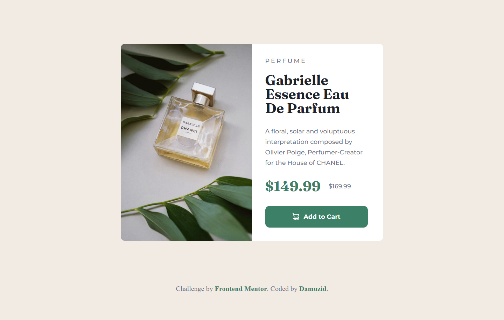

# Frontend Mentor - Product preview card component solution

This is a solution to the [Product preview card component challenge on Frontend Mentor](https://www.frontendmentor.io/challenges/product-preview-card-component-GO7UmttRfa). Frontend Mentor challenges help you improve your coding skills by building realistic projects. 

## Table of contents

- [Overview](#overview)
  - [The challenge](#the-challenge)
  - [Screenshot](#screenshot)
  - [Links](#links)
- [My process](#my-process)
  - [Built with](#built-with)
  - [What I learned](#what-i-learned)
  - [Continued development](#continued-development)
  - [Useful resources](#useful-resources)
- [Author](#author)

## Overview

### The challenge

Users should be able to:

- View the optimal layout depending on their device's screen size
- See hover and focus states for interactive elements

### Screenshot

### Links

- Solution URL: [Add solution URL here](https://your-solution-url.com)
- Live Site URL: [https://damuzid.github.io/](https://damuzid.github.io/)

## My process

I started out with creating the layout with div elements to get the two "columns" of the preview card, which I then made responsive with flexbox. When I had that working I implemented the product images and font styling/padding. The last part was creating the button including a hover colorchange.

### Built with

- Non-semantic HTML5 markup
- Flexbox
- CSS

### What I learned

I learned the basics of using @media to create a responsive layout and what you can do with flexbox. Altough it feels I kinda brute forced it with alot of div elements nested as a result.

### Continued development

Learn to use more semantic markup in my HTML code, which i didn't use at all. And a better understanding of flexbox and CSS in general. Read up on how to use Github.

### Useful resources

- [MDN Web Docs](https://developer.mozilla.org/en-US/) - I used the Mozilla Web Docs for information on flexbox.

## Author

- Github - [@Damuzid](https://github.com/Damuzid)
- Frontend Mentor - [@Damuzid](https://www.frontendmentor.io/profile/Damuzid)
